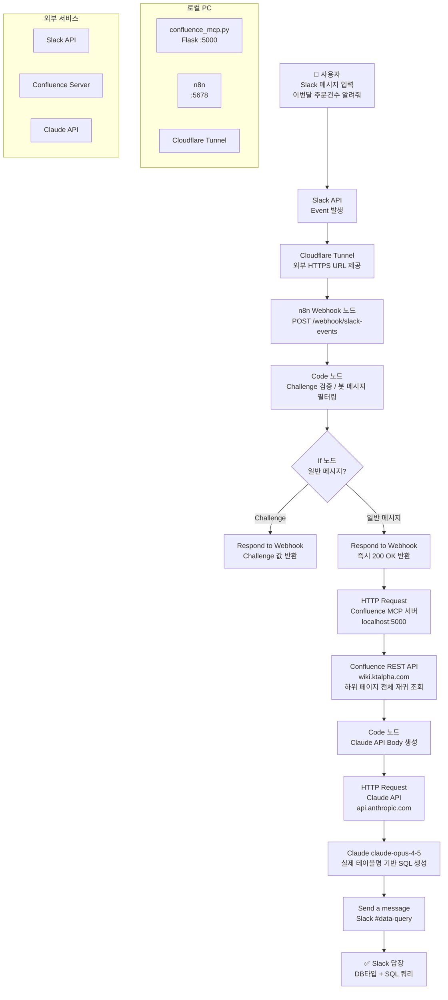

# 🤖 confluence-ai-query-bot

> Slack에서 자연어로 질문하면 → Confluence DB 스키마를 자동 조회하고 → Claude AI가 SQL을 생성해서 → Slack으로 답장해주는 자동화 워크플로우

---

## 📌 프로젝트 개요

사내 Confluence에 정리된 DB 스키마(ERD, 테이블 정의서)를 기반으로, Slack에서 자연어로 데이터 조회 요청을 하면 Claude AI가 실제 테이블명과 컬럼명을 사용한 SQL 쿼리를 자동 생성해서 Slack으로 응답해주는 시스템입니다.

DB에 직접 접근하지 않고 **SQL 쿼리만 생성**해서 전달하므로, 실제 실행은 사용자가 직접 합니다.
---

## 💬 사용 방법

Slack `#data-query` 채널에서 자연어로 질문하면 됩니다.

```
이번 달 주문 건수를 알려줘
```

```
KDI_QueryBot  오후 2:47
✅ 요청: 이번달 주문건수 알려줘
🗄 DB: ORACLE
📝 SQL:
SELECT COUNT(*) AS ORDER_COUNT FROM ORD_ORD_BSC_D
WHERE ORD_DTM >= TRUNC(SYSDATE, 'MM')
AND ORD_DTM < ADD_MONTHS(TRUNC(SYSDATE, 'MM'), 1)
```

---
## n8n flow


## 🏗️ 전체 아키텍처



---

## 🛠️ 사용 기술

| 분류 | 기술 | 용도 |
|---|---|---|
| 자동화 | n8n | 전체 워크플로우 오케스트레이션 |
| AI | Claude API (claude-opus-4-5) | 자연어 → SQL 변환 |
| 문서 | Confluence REST API | DB 스키마 조회 |
| 메신저 | Slack API (Socket Mode + Webhook) | 요청 수신 및 결과 전송 |
| 터널링 | Cloudflare Tunnel | 로컬 n8n을 외부에서 접근 가능하게 |
| 서버 | Python Flask | Confluence MCP 서버 |
| 런타임 | Node.js 20 LTS | n8n 실행 환경 |

---

## 📦 설치 항목

### 1. Node.js 20 LTS
n8n 실행에 필요합니다.
```
https://nodejs.org 에서 20 LTS 다운로드 후 설치
```

### 2. n8n
```powershell
npm install -g n8n
```

### 3. Python 패키지
```powershell
pip install flask requests
```

### 4. Cloudflare Tunnel
```powershell
winget install Cloudflare.cloudflared --source winget
```

---

## 🔑 필요한 API 키 및 계정

| 항목 | 발급처 | 용도 |
|---|---|---|
| Claude API Key | https://console.anthropic.com | SQL 생성 AI |
| Slack Bot Token (xoxb-) | https://api.slack.com/apps | 메시지 수신/전송 |
| Slack App Token (xapp-) | Slack App Basic Information | Socket Mode |
| Confluence 계정 | 사내 Confluence | DB 스키마 조회 |

> ⚠️ Claude API는 별도 크레딧 충전이 필요합니다. (최소 $5)

---

## 🚀 실행 방법

이 시스템은 **항상 3개의 프로세스가 동시에 실행**되어 있어야 합니다.

### PowerShell 창 1 — Confluence MCP 서버

```powershell
python C:\mcp\confluence_mcp.py
```

> Confluence에서 DB 스키마를 가져오는 로컬 API 서버입니다. (포트 5000)

### PowerShell 창 2 — n8n

```powershell
n8n start
```

> 전체 워크플로우를 실행하는 자동화 엔진입니다. (포트 5678)
> 브라우저에서 http://localhost:5678 접속 후 워크플로우가 **Published** 상태인지 확인하세요.

### PowerShell 창 3 — Cloudflare Tunnel

```powershell
cloudflared tunnel --url http://localhost:5678 --protocol http2
```

> Slack이 로컬 n8n으로 이벤트를 전달하려면 외부에서 접근 가능한 HTTPS URL이 필요합니다.
> Cloudflare Tunnel은 로컬 서버를 인터넷에 안전하게 노출시켜주는 역할을 합니다.
>
> ⚠️ 실행할 때마다 URL이 바뀌므로 Slack App Event Subscriptions의 Request URL도 새 URL로 업데이트해야 합니다.

---

## ⚙️ Slack App Event Subscriptions URL 업데이트

Cloudflare Tunnel 실행 시 매번 새 URL이 생성됩니다.

```
예시: https://graphics-vault-residential-pvc.trycloudflare.com
```

아래 경로에서 URL 업데이트가 필요합니다:

1. https://api.slack.com/apps → QueryBot
2. **Event Subscriptions** → **Request URL** 변경:
```
https://[새로운-cloudflare-url]/webhook/slack-events
```
3. **Verified** 확인 → **Save Changes**

---

## 📁 프로젝트 구조

```
confluence-ai-query-bot/
├── README.md
├── n8n/
│   └── workflow.json          # n8n 워크플로우 (import 가능)
├── mcp/
│   └── confluence_mcp.py      # Confluence MCP 서버
├── docs/
│   ├── architecture.md        # 아키텍처 상세 설명
│   └── troubleshooting.md     # 시행착오 정리
└── .env.example               # 환경변수 예시
```
---

## 📋 환경변수 예시

```
CONFLUENCE_URL=https://wiki.your-company.com
CONFLUENCE_USERNAME=your_username
CONFLUENCE_PASSWORD=your_password
CONFLUENCE_ROOT_PAGE_ID=186452952
CLAUDE_API_KEY=sk-ant-api03-xxxxx
SLACK_BOT_TOKEN=xoxb-xxxxx
SLACK_APP_TOKEN=xapp-xxxxx
```
