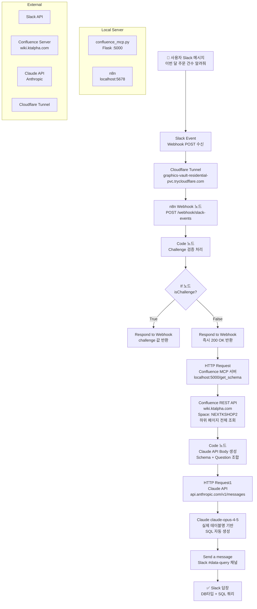

## 레포지토리 기본 정보

**Repository Name:**
```
confluence-ai-query-bot
```

**Description:**
```
Slack으로 자연어 질문 → Confluence DB 스키마 자동 조회 → Claude AI SQL 생성 → Slack 답장까지 자동화한 n8n 워크플로우
```

**Topics (태그):**
```
n8n, slack-bot, confluence, claude-ai, automation, sql-generation, workflow
```

---

## n8n flow

   

## 전체 플로우 Mermaid 다이어그램



---

## 시행착오 정리 (README에 넣을 내용)

```markdown
## 🚧 개발 중 시행착오

### 1. n8n 실행 정책 오류 (Windows)
- **문제**: PowerShell에서 `n8n start` 실행 시 스크립트 실행 차단
- **원인**: Windows PowerShell 보안 정책
- **해결**: `Set-ExecutionPolicy -ExecutionPolicy RemoteSigned -Scope CurrentUser`

### 2. Slack Trigger 외부 URL 문제
- **문제**: Slack이 localhost로 webhook 전달 불가
- **시도**: ngrok → 인증 오류 / localtunnel → 503 에러 / n8n Cloud → 유료
- **해결**: Cloudflare Tunnel (`--protocol http2`) 으로 해결

### 3. Slack Socket Mode 불안정
- **문제**: n8n 2.8.4에서 Socket Mode 연결은 되나 이벤트 수신 안 됨
- **해결**: Webhook 방식으로 전환 + Cloudflare Tunnel 조합

### 4. Slack Challenge 검증 실패
- **문제**: Slack URL 등록 시 challenge 파라미터 응답 못 함
- **해결**: Code 노드에서 url_verification 타입 처리 + 즉시 200 OK 응답

### 5. Slack 중복 응답 문제
- **문제**: 메시지 하나에 수십 번 반복 응답
- **원인**: Claude API 처리 시간 > 3초로 Slack이 재시도
- **해결**: Respond to Webhook 노드를 If 분기 직후로 이동해서 즉시 200 반환

### 6. AI API 선택 문제
- **시도1**: Claude API → 크레딧 부족
- **시도2**: Gemini API → 한국 무료 티어 차단 (limit: 0)
- **시도3**: Ollama (llama3.2) → CPU 95% (Ryzen 7 4700U 한계)
- **해결**: Claude API $5 크레딧 충전

### 7. Confluence 연동 방식
- **문제**: Space Key 방식으로 검색 시 keyword 의존적
- **해결**: pageId 기반으로 최상단 페이지(186452952) 하위 전체 재귀 조회

### 8. Gmail OAuth 실패
- **문제**: localhost 환경에서 Google OAuth 콜백 불가
- **해결**: Slack으로 결과 전송 방식으로 변경

### 9. n8n localhost 연결 문제
- **문제**: n8n에서 localhost:5000 접근 거부
- **해결**: localhost → 127.0.0.1 로 변경
```

---

## GitHub 레포 구성

```
confluence-ai-query-bot/
├── README.md
├── n8n/
│   └── workflow.json          ← n8n 워크플로우 export
├── mcp/
│   └── confluence_mcp.py      ← Confluence MCP 서버
├── docs/
│   ├── architecture.md        ← 아키텍처 설명
│   ├── setup.md               ← 설치 가이드
│   └── troubleshooting.md     ← 시행착오 정리
└── .env.example               ← 환경변수 예시
```
### Step 3 — 로컬 폴더 구성

```powershell
mkdir C:\projects\confluence-ai-query-bot
cd C:\projects\confluence-ai-query-bot
mkdir n8n, mcp, docs
```

--
